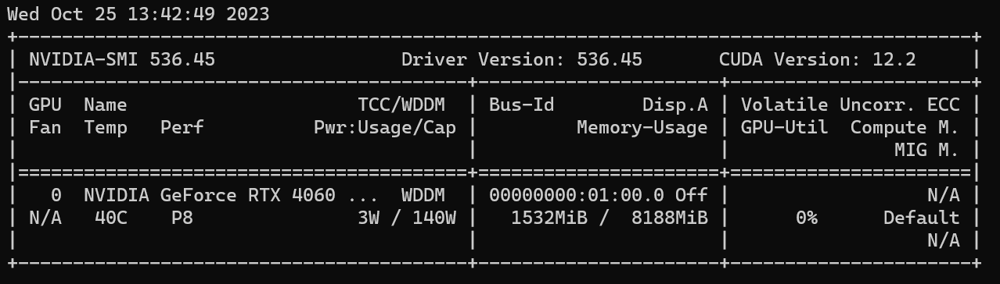
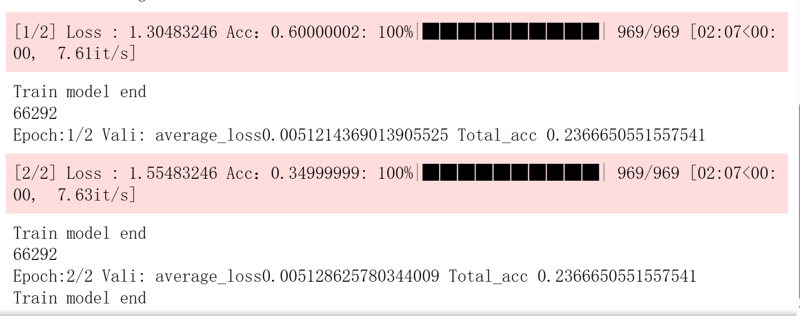

# Train and Vali

## 一、实验配置

### 1.1软件配置

```
python --- 3.10.13
numpy  --- 1.26.0
pandas  --- 2.0.3
sklearn  --- 1.3.0
torch --- 2.0.1
tqdm  --- 4.65.0
nltk --- 3.8.1
```

附：整个实验环境在anaconda中创建环境，然后在里面输入以下的命令（官网可见）

[https://pytorch.org/get-started/previous-versions/]: 	"pytorch官网"


```
conda install pytorch==2.0.1 torchvision==0.15.2 torchaudio==2.0.2 pytorch-cuda=11.8 -c pytorch -c nvidia
```

### 1.2 硬件配置



## 二、实验结果


这个文件只是为了测一测我自己写的transformer能不能跑，对不对，至于用不用的好，不是本次实验的重点。


